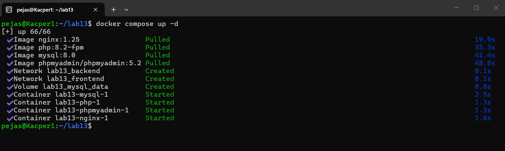
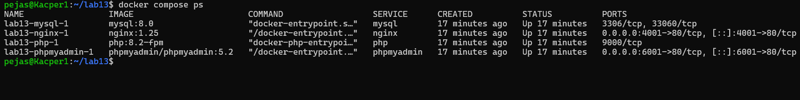
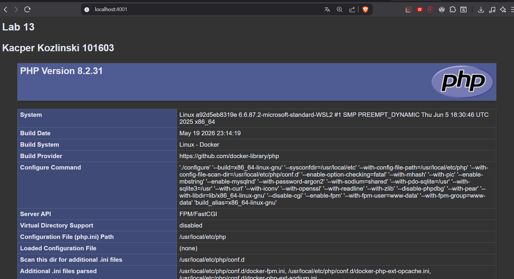
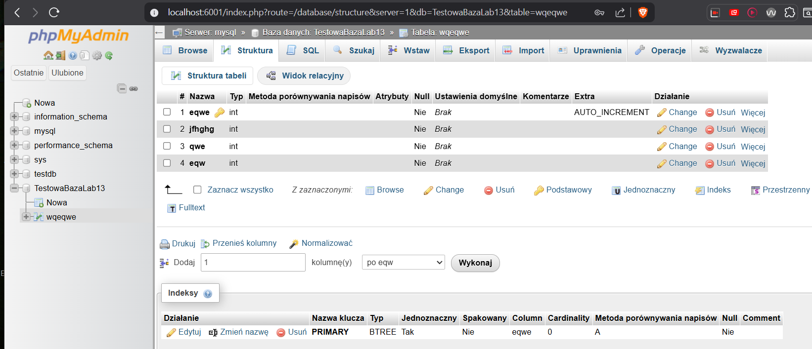

# lab13
### Kacper Kozlinski
### 101603

## Czesc Obowiazkowa

### Uzasadnienie przydzialu sieci dla phpMyAdmin
phpMyAdmin zostal podłączony wylacznie do sieci backend, poniewaz musi komunikowac się bezposrednio z kontenerem MySQL, ktory znajduje się w tej sieci. Dostep z zewnątrz jest zapewniony przez zmapowany port 6001, wiec podlczenie do sieci frontend byłoby zbedne.

### Uzyte polecenia
Do realizacji zadanie zostaly wykorzystane 2 polecenia

`docker compose up -d` - do uruchomienia wielokontenerowej aplikacji

wynik polecenia:

`docker compose ps` - do sprawdzenia poprawnosci dzialania

### Dowod dzialania

### LEMP
dowodem dzialanie jest dzialajaca strona localhost:4001 ktora zostala zdefiniowana w pliku html/index.php i zostala wyswietlona funkcja phpinfo()

### inicjacja testowej bazy danych

baza zostala zainicjalizowana poprawnie widac to na screenie ponizej

